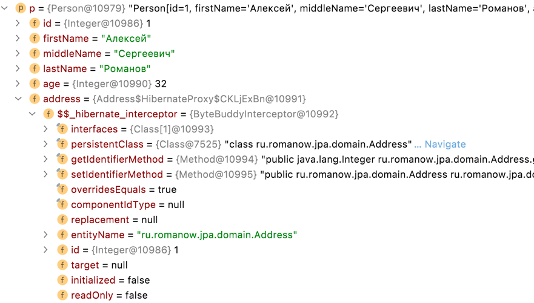

# JPA example

## Использование Hibernate + JPA

##### Настройка JPA spring.jpa.open-in-view=false

> Spring web request interceptor that binds a JPA EntityManager to the thread for the entire processing of the request.
> Intended for the "Open EntityManager in View" pattern, i.e. to allow for lazy loading in web views despite the original
> transactions already being completed.

Класс `OpenEntityManagerInViewInterceptor` в методе `preHandle` открывает `EntityManager` для текущего запроса, т.е.
Spring создает обрамляющую транзакцию на _весь_ запрос.

Выключение этого параметра (`spring.jpa.open-in-view=false`) приведет к тому, что инициировать транзакцию для работы со
смежными данными нужно будет руками.

Это правильный подход, т.к. он дает котроль над транзакционной целостью запроса.

Если использовать `CrudRepository` (или его наследников), то Spring в runtime в proxy подкладывает
реализацию `SimpleJpaRepository`, которая помечена аннотацией `@Transasctional(readOnly = true)` на уровне класса. Т.е.
транзакция создается на каждый запрос.

##### В коде используем явное управление транзакциями через `@Transactional`

Использование транзакций гарантирует:

* Атомарность (Atomicity) – гарантирует, что никакая транзакция не будет зафиксирована в системе частично. Будут либо
  выполнены все операции внутри транзакции, либо не выполнено ни одной.
* Консистентность (Consistency) – транзакция, достигающая своего нормального завершения и, тем самым, фиксирующая свои
  результаты, сохраняет согласованность базы данных.
* Изолированность (Isolation) – гарантирует что никакой поток данных не может читать данные из еще не завершенной
  транзакции.
* Долговечность (Durability) – если транзакция завершена, то все данные записаны на диск.

Если в рамках запроса выполняется модификация нескольких таблиц, то без ипользования общей транзакции в случае ошибки
откат изменений не будет выполнен или будет выполнен частично, что приведет к _неконсистентности_ данных.

В PostgreSQL уровень изоляции по-умолчанию Read Committed, т.е. гарантирует отсутствие Lost Updates и Dirty Reads.

Т.к. операции в бизнес сценарии часто подразумевают изменения в нескольких таблицах, то все эти изменения нужно
заворачивать в единую транзакцию, чтобы достичь консистентности данных.

Если брать классическое Spring Boot приложение со Spring MVC, то выделяется три главных части:

* web: `@Controller`, `@ControllerAdvice`, `Filter`, и т.п. – уровень представления, здесь находится описание API.
* service: `@Service`, `@Component` – бизнес логика приложения.
* dao: `@Entity`, `@Repository`, `CrudRepository`, `JpaRepository` и т.п. – слой доступа к данным.

Транзакции нужно использовать на уровне service, т.к. именно там находится бизнес-логика приложения и именно этот слой
ответственен за корректность (консистентность) работы с данными.

Уровень web является представлением и его задача – описание API, а значит бизнес логики (а значит и транзакций) на этом
уровне быть _не должно_.

Уровео dao является слоем доступа к данными, здесь обычно описываются _отдельные_ обращения к БД, а значит оборачивать
их в транзакцию бессмысленно.

Теперь рассмотрим подробнее разбиение бизнес функционала по сервисам. Если в сервисе выделяется больше одной доменной
области, например, User и Wallet, то все классы (web, mappings, models, repositories, services), связанные с ними,
должны находится в отдельном пакете user и wallet соответственно.

* Для того, чтобы сервис (`@Service`) был изолированный, он должен взаимодействовать только с DAO и репозиториями из
  своего домена. Т.е. если нам в `WalletService` нужно получить пользователя, то мы должны использовать `UserService`, а
  не работать напрямую с `UserRepository`. Иначе нарушается Single Responsibility принцип и сильно усложняются unit
  тесты.
* Если есть какие-то общие классы, сервисы, то они выносятся в пакет common (например, `@RestControllerAdvice`).

Разбиение по доменным сущностям:

* Доменная область обычно 1 к 1 связана с бизнес процессом, т.е. у вас в одном пакете есть контроллеры (и сервисы),
  которые выполняют разную функциональность из разных use-case'ов (работа с пользователем (создание, блокировка) и
  работа с кошельком (создание, пополнение, закрытие)), то это обычно различные доменные области.
* Если у вас есть необходимость в sql / jpa запросе использовать join на таблицы из разных доменных областей, то лучше
  это делать в java коде, потому что в случае дальнейшего распила сервиса на части, сущности из этого join могут начать
  относиться к разным сервисам, а значит join придется распиливать.
* К одной доменной сущности могут относится объекты, которые будут невалидны без основной сущности. Например, User →
  Address, адрес будет невалиден без привязки к пользователю, но Address → Country, Address → City уже не будут в одном
  домене, т.к. Country и City могут потребоваться в других процессах.

##### Использование автогенерации схем данных JPA в прод среде запрещено

Автогенерация DDL занимает много времени, т.к. Hibernate через метаинформацию вытягивает структуру БД и сравнивает ее с
описанием в `@Entity`.

Правильным и контролируемым подходом для работы со схемой базы данных являются скрипты миграции. Для Java есть два
основных инструмента:

* [Flyway](https://flywaydb.org/documentation/usage/plugins/springboot), интеграция со Spring
  Boot [Use a Higher-level Database Migration Tool](https://docs.spring.io/spring-boot/docs/current/reference/htmlsingle/#howto.data-initialization.migration-tool)
  .
* [Liquibase](https://liquibase.org/get-started/quickstart), интеграция со Spring
  Boot [Using Liquibase with Spring Boot](https://docs.liquibase.com/tools-integrations/springboot/springboot.html).

Liquibase более мощный инструмент, например он умеет делать rollback изменений или импорт данных из CSV, но описание
миграций в нем реализуется через XML, что приносит некоторые неудобства.

Для production среды нужно _полностью_ выключить генерацию DDL.

```properties
spring.jpa.generate-ddl=false
spring.jpa.hibernate.ddl-auto=none
```

Для тестовых сред возможно использовать уровень `validate`, чтобы гарантировать консистентность схемы БД и
описания `@Entity`.

```properties
spring.jpa.generate-ddl=true
spring.jpa.hibernate.ddl-auto=validate
```

##### Применять тип загрузки FetchType.LAZY

Существуют 4 типа связей сущностей в Hibernate:

* `@OneToOne` (EAGER) – связь 1:1, реализуется через Foreign Key, реализовать LAZY без отдельных костылей нельзя.
* `@OneToMany` (LAZY) – возвратный ключ, указывает на список записей, которые ссылаются через Foreign Key на текущую
  запись. Делать связь EAGER плохая практика, т.к. на каждый запрос будет подниматься большое количество лишних записей.
  Если в каком-то случае нужны все записи, то можно использовать `join fetch` или `@EntityGraph`.
* `@ManyToOne` (EAGER) – прямой ключ на запись, в описании указывается `@JoinColumn`. Если эта связь не нужна во всех
  запросах, то лучше ее тоже делать LAZY, а поднимать только в случае необходимости.
* `@ManyToMany` (LAZY) – связь многое-ко-многим, реализуется через смежную таблицу. Делать EAGER нельзя, т.к. это
  свидетельствует о плохо спроектированной базе данных.

Изменение типа связи с LAZY на EAGER _крайне_ не рекомендуется, это может очень негативно сказаться на
производительности, т.к. при поднятии одной сущности, будут подниматься еще N дополнительных сущностей.

При этом, если связь помечена LAZY, а обращение к ней выполняется вне транзакции, то будет
выброшен `LazyInitializationException` (подробнее в примерах). Для предотвращения такой ситуации нужно явно использовать
транзакции и (или) использовать `join fetch` и `@EntityGraph` в случае, когда эти данные нужны в получаемом результате.

### Пояснения и комментарии

#### Использование MapStruct

Отдавать в ответе сервиса сущность `@Entity` очень плохая практика, т.к. это приводит к некотролируемому поведению
приложения. Создают специальные сущности, именуемве DTO (Data Transfer Object), которые служат моделями для запросов /
ответов.

Это в свою очередь приводит к необходимости писать мапперы в/из DTO из/в `@Entity`. Часто для решения этой проблемы
используется библиотека [MapStruct](https://mapstruct.org/documentation/stable/reference/html/). Но при сложных объектах
она может сильно усложнить и запутать код и привести к лишних запросам в базу данных при маппинге.

Задача маппера просто переложить готовые данные из одного объекта в другой.

_Выделим основное правило_: маппинг выполняется _вне_ транзакции, т.е. на вход маппера мы получаем объект вне сессии
Hibernate.

##### Маппинг `@Entity` -> DTO

Если маппер находится между слоем web и service, т.е. он переводит из внутреннего представления `@Entity`, с которым
работает service во внешнюю модель, с которой работает слой web. И он это должен делать по уже сформированному объекту.
Т.е. если есть метода, отличающихся наполнением ответа (в одном есть вложеннный объект address, в другом нет), то это
будут два маппера, которые будут понимать нужно ли обращаться к полю address в `@Entity`. Т.к. MapStruct требует только
описание интерфейсов, это просто будет два метода, отличающихся аннотацией
`@Mapping(target = "address", ignore = true)`, всю остальную работу сделает MapStruct.

##### Маппинг DTO -> `@Entity`

Обратное преобразование сложнее, т.к. если требуется выполнить обновление объекта (например PATCH), то нужно по id
связной сущности поднять ее из БД и модифицирвать, а если она не найдена, то создать новую. А значит потребуется
использовать `@ManyToOne(cascade = CascadeType.ALL)` и внутренню магию Hibernate, что сильно усложнит понимание работы
приложения. Так же при удалении объекта могут потребоваться удалять все подчиненные сущности, а значит нужно будет
использовать `orphanRemoval = true`. Это потребует использование маппера в транзакции, что повлечет увеличение его зоны
ответственности, а следовательно, усложнению.

Попытка обновления сложного объекта со вложенными подъобъектами через MapStruct приведет к использованию `cascade`
и `orphanRemoval`, что сделает код непрозрачным.

Для преобразования DTO -> `@Entity` лучше использовать нативную работу со всеми вложенными сущностями, а мапперы
использовать только для перекладывания plain java fields. Т.е. все `@OneToMany`, `@ManyToOne`, `@OneToOne`,
`@ManyToMany` разбираем руками, а поля `String`, `Integer`, `BigDecimal` и т.п. перекладываем через мапперы.

#### Выполнение внешних вызовов из сервиса, помеченного `@Transcational`

##### REST запрос

##### Отправка данных через очередь

## Примеры

```java
/**
 * Register OpenEntityManagerInViewInterceptor. Binds a JPA EntityManager to the
 * thread for the entire processing of the request.
 */
private Boolean openInView;
```

Если выключаем `spring.jpa.open-in-view=false`, тогда при запросе `GET http://localhost:8080/` получаем
LazyInitializationException.

```
Servlet.service() for servlet [dispatcherServlet] in context with path [] threw exception [Request processing failed; nested exception is org.hibernate.LazyInitializationException: could not initialize proxy [ru.romanow.jpa.domain.Address#1] - no Session] with root cause

org.hibernate.LazyInitializationException: could not initialize proxy [ru.romanow.jpa.domain.Address#1] - no Session
	at org.hibernate.proxy.AbstractLazyInitializer.initialize(AbstractLazyInitializer.java:170) ~[hibernate-core-5.4.32.Final.jar:5.4.32.Final]
	at org.hibernate.proxy.AbstractLazyInitializer.getImplementation(AbstractLazyInitializer.java:310) ~[hibernate-core-5.4.32.Final.jar:5.4.32.Final]
	at org.hibernate.proxy.pojo.bytebuddy.ByteBuddyInterceptor.intercept(ByteBuddyInterceptor.java:45) ~[hibernate-core-5.4.32.Final.jar:5.4.32.Final]
	at org.hibernate.proxy.ProxyConfiguration$InterceptorDispatcher.intercept(ProxyConfiguration.java:95) ~[hibernate-core-5.4.32.Final.jar:5.4.32.Final]
	at ru.romanow.jpa.domain.Address$HibernateProxy$zoO4cARL.getCity(Unknown Source) ~[classes/:na]
	at ru.romanow.jpa.mapper.AddressMapperImpl.toModel(AddressMapperImpl.java:24) ~[classes/:na]
	at ru.romanow.jpa.mapper.PersonMapperImpl.toModel(PersonMapperImpl.java:32) ~[classes/:na]
	at java.base/java.util.stream.ReferencePipeline$3$1.accept(ReferencePipeline.java:195) ~[na:na]
	at java.base/java.util.ArrayList$ArrayListSpliterator.forEachRemaining(ArrayList.java:1654) ~[na:na]
    ...
```

### Способы исправления

##### Использование `@Transactional` в сервисном слое

Если метод в сервисе пометить аннтоацией `@Transactional`, тогда подзапросы будут выполняться в рамках сессии:

```java

@Service
@RequiredArgsConstructor
public class PersonServiceImpl
        implements PersonService {
    private final PersonRepository personRepository;
    private final PersonMapper personMapper;

    @Override
    @Transactional(readOnly = true)
    public List<PersonResponse> findAll() {
        return personRepository.findAll()
                .stream()
                .map(personMapper::toModel)
                .collect(Collectors.toList());
    }
}
```

При этом сначала будет поднята сущность Person, а поле address будет HibernateProxy, который при первом обращении к
сущности выполнит дополнительный запрос к базе данных и поднимет Address по ID.



При LAZY инициализации сущности, по ссылке на объект хранится Hibernate Proxy, который реализован с помощью библиотеки
ByteBuddy. При обращении к методу `person.getAddress()` срабатывает method
interceptor `$$_hibernate_interceptor: ByteBuddyInterceptor`, который содержит всю необходимую информацию для выполнения
запроса к БД. После первого запроса внутри Hibernate Proxy заполняется поле `target` и уже все последующие запросы к
сущности делегируются к этому полю.

##### Использование `@Query` и конструкции join fetch

Если в запросе указать `join fetch` (вместо просто `join`), то Hibernate в блок `select` включит поля из `join` и
размапит результат в связанную сущность.

```java
public interface PersonRepository
        extends JpaRepository<Person, Integer> {

    @Query("select p from Person p join fetch p.address")
    List<Person> findPersonAndAddress();
}

@Service
@RequiredArgsConstructor
public class PersonServiceImpl
        implements PersonService {
    private final PersonRepository personRepository;
    private final PersonMapper personMapper;

    @Override
    public List<PersonResponse> findAll() {
        return personRepository.findPersonAndAddress()
                .stream()
                .map(personMapper::toModel)
                .collect(Collectors.toList());
    }
}
```

##### Использовать EntityGraph для конкретного метода

Начиная с версии JPA 2.1 появилась конструкция `@EntityGraph`, с помощью которой можно переопределять порядок загрузки
сущностей, описанных в `@Entity`. Т.е. если в `@Entity` описано:

```java

@Entity
@Table(name = "person")
public class Person {

    ...

    @ManyToOne(fetch = FetchType.LAZY)
    @JoinColumn(name = "address_id", foreignKey = @ForeignKey(name = "fk_person_address_id"))
    private Address address;
    
    ...
}
```

а в запросе указано `@EntityGraph(attributePaths = "address")`, то в едином запросе будет подняты сущности Person и
Address.

```java
public interface PersonRepository
        extends JpaRepository<Person, Integer> {

    @EntityGraph(attributePaths = "address")
    @Query("select p from Person p")
    List<Person> findAllUsingGraph();
}

@Service
@RequiredArgsConstructor
public class PersonServiceImpl
        implements PersonService {
    private final PersonRepository personRepository;
    private final PersonMapper personMapper;

    @Override
    public List<PersonResponse> findAll() {
        return personRepository.findAllUsingGraph()
                .stream()
                .map(personMapper::toModel)
                .collect(Collectors.toList());
    }
}
```

##### Использование `@Column` при поиске по ID поля, помеченного `@ManyToOne`

Если для запросов сущностей, помеченных `@ManyToOne` нужно поднять сущность по ID, то можно рядом с `@ManyToOne` описать
сам ID:

```java

@Entity
@Table(name = "person")
public class Person {

    ...

    @Column(name = "address_id", updatable = false, insertable = false)
    private Integer addressId;

    @ManyToOne(fetch = FetchType.LAZY)
    @JoinColumn(name = "address_id", foreignKey = @ForeignKey(name = "fk_person_address_id"))
    private Address address;
    
    ...
}
```

```jpaql
select u.name from User u where u.addressId = :addressId
```

### Запуск приложения

```shell
# сборка проекта
$ ./gradlew clean build

# запуск postgres 13 в docker
$ docker compose up -d

# запуск приложения
$ ./gradlew bootRun

# выполняем запрос
$ curl http://localhost:8080/api/v1/persons -v | jq
```